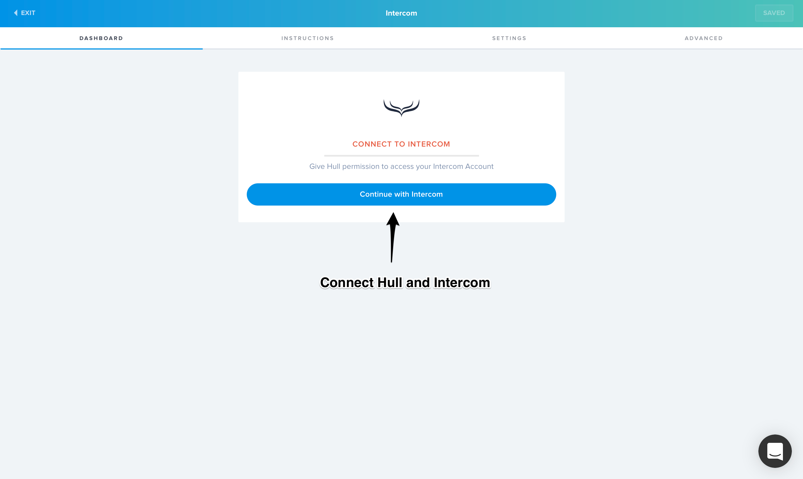
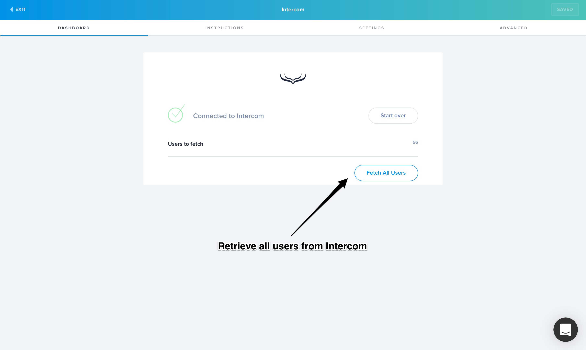
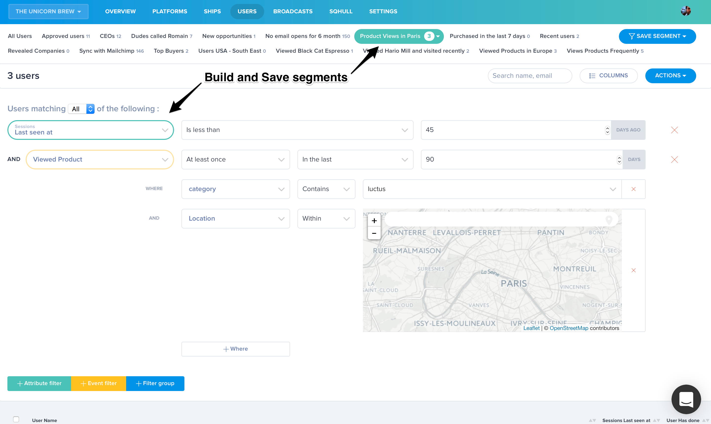
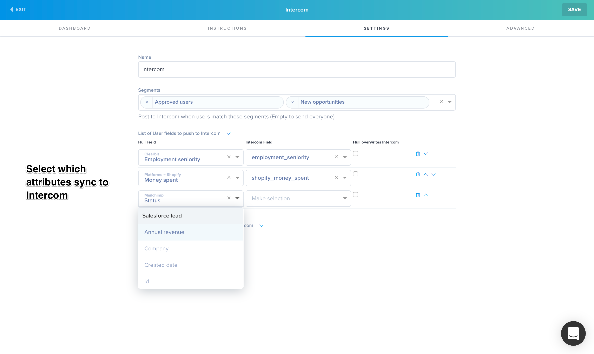

# Hull ♥ Intercom

Intercom let's you send messages to your contacts via email, website live chat and mobile push notifications. You can trigger and track all your messages and interactions back into your contacts profiles, and then use this data to trigger more messages.

#### Intercom data includes:

- Identities (name, email, company, location…)
- Events (logged in, account created, subscribed…)
- Page views (Viewed "Features" page, Viewed "Demo Request" page…)
- Segments ("Leads", "New Paying Customers", "Job Title - CEOs")

#### With Hull, you can power other tools with this Intercom data.

Share and sync your contact and event data from Intercom to do things like:

- Power Salesforce contact records
- Trigger Slack notifications
- Sync Intercom segments with Mailchimp
- Sync Intercom segments with Optimizely

You can also upgrade your Intercom operation with data from other tools and databases. You can use all your data together to create scores, trigger automations (like Intercom Campaigns and web chats) and define personalisation.

- Upgrade Intercom with behavioural data from Mixpanel
- Enrich Intercom profiles with data from Clearbit
- Trigger Intercom Campaigns with Slack commands and buttons
- Personalise Intercom web chat with data from Salesforce

Hull also gives you more flexibility with your data in Intercom. Combine multiple sources of data to create advanced segments (without the limits to AND and OR) and user scores using all your data.

- No APIs to tap into
- No code needed
- No import/export
- No complexity
- No repetitive workflow or segment creation

## Installing

Install the Ship


Click the "Connect to Intercom" button on the Dashboard page & Authorize Hull to access your account.



Optional: Click "Fetch All" if you want to import all Intercom users into Hull



## Usage

Create and save some Segments in Hull



Select which users are synchronized to Intercom by specifying the segments they need to belong to.


Intercom Users will be tagged with every Hull segment they belong to.


Select Hull attributes to send to Intercom



Select Intercom custom attributes to retrieve (Standard attributes are fetched automatically)


## Better leads to user linking

For better leads matching add Hull.js to your website:

1. Install the base initialization snippet:
  ```html
  <script
    id="hull-js-sdk"
    data-platform-id="YOUR_PLATFORM_ID"
    data-org-url="https://ORG_NAMESPACE.hullapp.io"
    src="https://js.hull.io/0.10.0/hull.js.gz"></script>
  ```

2. Below that snippet add another one which does the linking:
  ```html
  <script>function getAnonymousId(){if(window.Intercom&&window.Intercom("getVisitorId"))return window.Intercom("getVisitorId")}function waitForAnonymousId(o){if((check+=1)<20&&!getAnonymousId())return setTimeout(waitForAnonymousId,100);getAnonymousId()&&o(getAnonymousId())}var check=0;Hull.ready(function(){waitForAnonymousId(function(o){Hull.api({path:"/me/alias"},"post",{anonymous_id:"intercom:"+o})})});</script>
  ```
